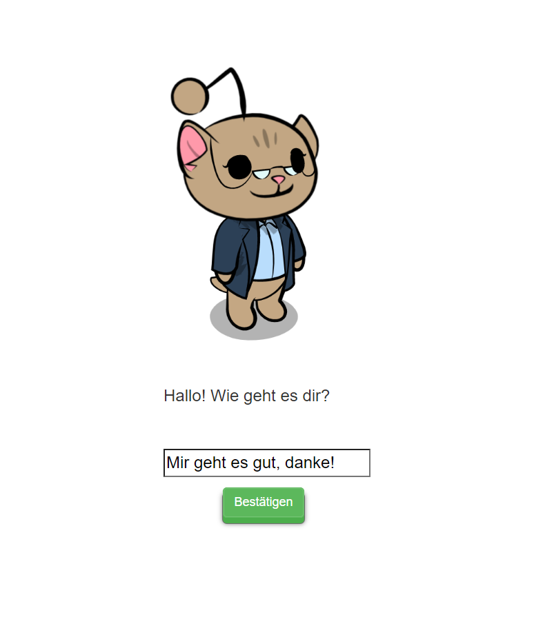

# Basic FLASK server with REST webhook for communicating with RASA server:

1. create a Python virtual environment -> "python -m venv venv"

2. activate virtual environment -> bash: ". venv/Scripts/activate" cmd: "venv/Scripts/activate"

3. install the dependencies in requirements.txt -> "pip install -r requirements.txt" 

4. start your rasa server on port 5005 (default) in your rasa project folder (you need a trained model for that -> they are in /models -> if empty run "rasa train" first) -> "rasa run -m models --enable-api" 

5. start tts and stt services by running "docker compose up"

6. start flask server by running app.py (it will run on port 5000 by default) -> "python app.py"

7. visit localhost:5000 or wherever you hosted your server
